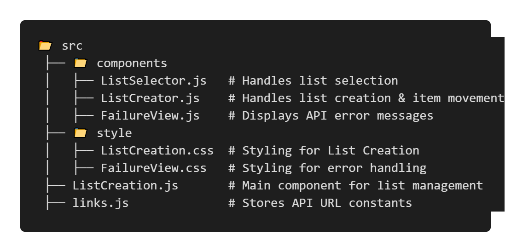

## List Creation App:

This project is a React-based List Management Application that allows users to fetch lists from an API, select two lists, and create a new list by moving items between them.

#### Deployment Link: `https://govindrajewar.github.io/NxtWave-React-Assignment/`

## Features:
✅ Fetches list data from an API.

✅ Handles API errors with a retry mechanism.

✅ Allows users to select exactly two lists for creating a new list.

✅ Enables moving items between lists dynamically.

✅ Displays a loader during API calls.

✅ Fully responsive UI.

## Installation:

## 1. Clone the Repository

#### `git clone https://github.com/Govindrajewar/NxtWave-React-Assignment.git`
#### `cd client`

## 2. Install Dependencies

#### `npm install`

## 3. Start the Application

#### `npm start`

The app will be available at http://localhost:3000/.

## File Structure:
 

## API Integration:

The app fetches data from:

`const List_Creation_API_URL = "https://your-api-endpoint.com/lists";`

Improvements Made
Optimized list filtering using dynamic object mapping.
Persisted new lists when updating.
Enhanced API error handling to differentiate errors.
Improved item movement logic for better efficiency.

## To Do:
✅ Save lists permanently after creation.

✅ Improve UI animations for item movements.

✅ Add unit tests for API calls.

## License:
This project is open-source and available under the MIT License.